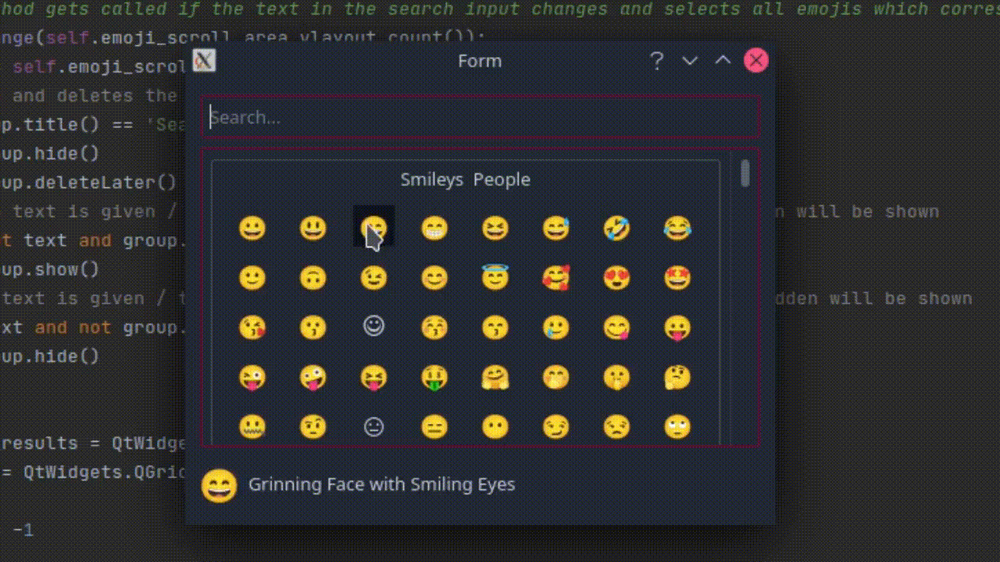
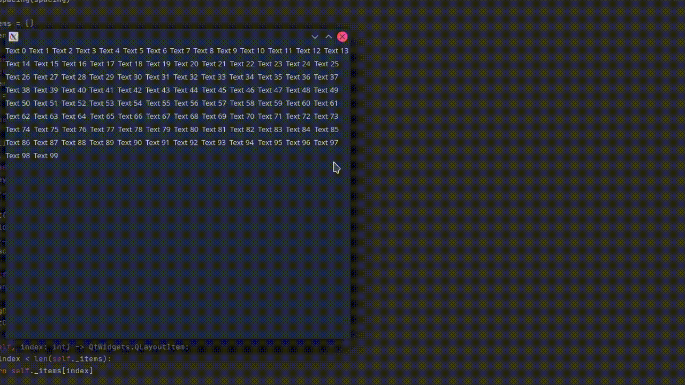
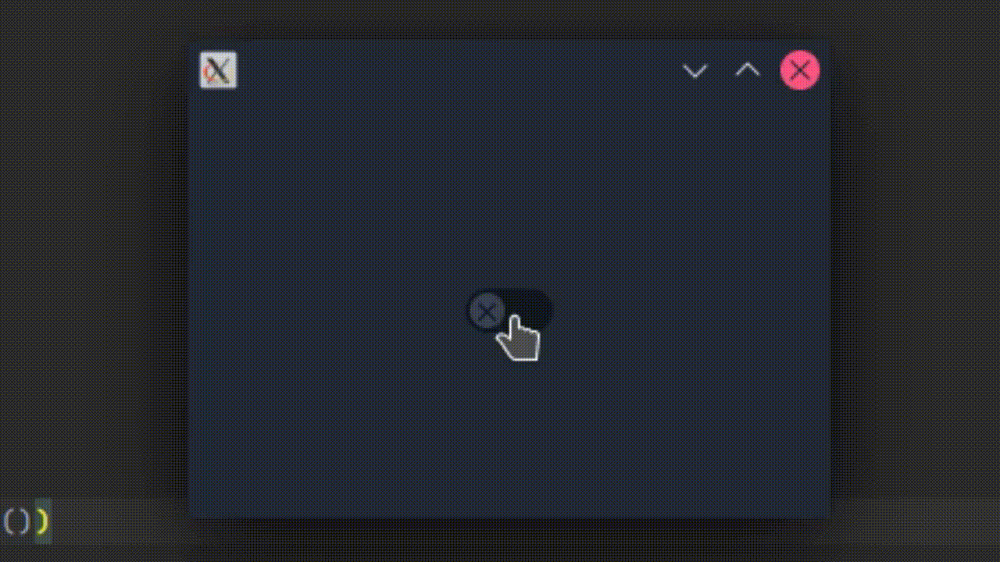
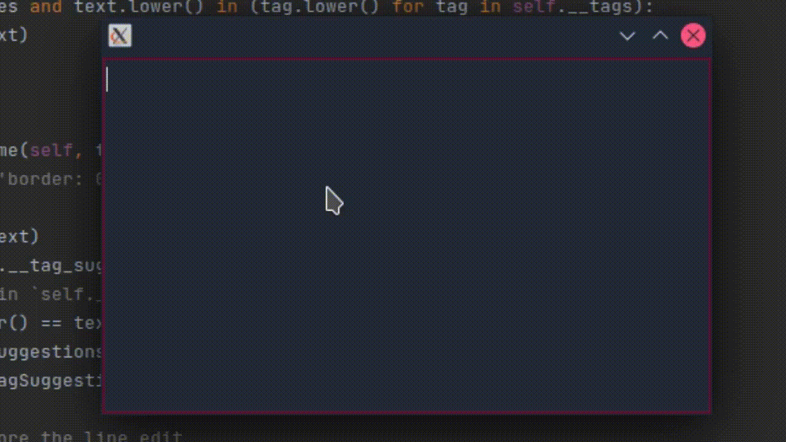

# PyQt5-expansion
This is a collection of PyQt5 classes, which I'm using or I have used.

Because i use KDE Plasma, the look of the objects on your system may be different than my [demonstrations](/assets)

## QEmojiPicker

A resizable widget which let you choose from various emojis.
NOTE: Not every emoji looks "nice" in PyQt5 so you may have to install a custom font

<details>
    <summary>Demonstration</summary>
    
</details>

```python
from PyQt5 import QtWidgets # import pyqt5
from QOptionObjects import QEmojiPicker # import the emoji picker

if __name__ == '__main__':
    # create a new app
    app = QtWidgets.QApplication([])
    
    # initializes the emoji picker
    emoji_picker = QEmojiPicker(
        # this option can say how many emojis are in a row
        items_per_row=8,
        # with this enabled, the emoji search will be faster but less accurate
        performance_search=True
    )

    # this will open the emoji picker and return the selected emoji
    print(emoji_picker.select())
```

## QFlowLayout
*Inspired from https://github.com/baoboa/pyqt5/blob/master/examples/layouts/flowlayout.py*

A hydrodynamic layout which rearranges the items in it dynamically if its resized

<details>
    <summary>Demonstration</summary>
    
</details>

```python
from PyQt5 import QtWidgets # import pyqt5
from QOptionObjects import QFlowLayout # import the flow layout

if __name__ == '__main__':
    # create a new app
    app = QtWidgets.QApplication([])
    widget = QtWidgets.QWidget()
    
    # initializes the layout
    layout = QFlowLayout()
    
    # add 100 labels to see its resize function
    for i in range(100):
        layout.addWidget(QtWidgets.QLabel(f'Text {i}'))
    
    # set the layout to the widget and show it
    widget.setLayout(layout)
    widget.show()

    app.exec()
```

## QSwitch
*Inspired from https://stackoverflow.com/questions/14780517/toggle-switch-in-qt*

A simple toggle switch

<details>
    <summary>Demonstration</summary>
    
</details>

```python
from PyQt5 import QtWidgets # import pyqt5
from QOptionObjects import QSwitch # import the switch

if __name__ == '__main__':
    # create a new app
    app = QtWidgets.QApplication([])
    widget = QtWidgets.QWidget()
    layout = QtWidgets.QHBoxLayout()
    
    # initializes the switch
    switch = QSwitch()
    
    # add the switch to the layout
    layout.addWidget(switch)
    
    # set the layout to the widget and show it
    widget.setLayout(layout)
    widget.show()

    app.exec()
```

# QTagEdit

A widget where you can create, delete and edit tags

<details>
    <summary>Demonstration</summary>
    
</details>

```python
from PyQt5 import QtWidgets # import pyqt5
from QOptionObjects import QTagEdit # import the tag edit

if __name__ == '__main__':
    # create a new app
    app = QtWidgets.QApplication([])

    # creates the tag edit
    tag_edit = QTagEdit(
        # here you can set some suggestion that will be shown if the user types in something
        tag_suggestions=['tag 1' 'tag 2', 'tag 3']
    )
    # manually add a tag
    tag_edit.addTag('a tag')
    # manually remove a tag
    tag_edit.removeTag('a tag')
    
    # clear all tags
    tag_edit.clear()
    # clear all tags and add the given tag after this operation
    tag_edit.setTags(['a tag', 'another tag'])
    
    # sets the tag suggestions you can also define when initializing the class
    tag_edit.setTagSuggestions(['1 tag', '2 tag', '3 tag'])
    
    # if True, the user will be unable to define a tag with the same name twice 
    tag_edit.enableCheckForDoubles(True)
    # if True, the tag suggestions will e shown
    tag_edit.enableTagSuggestions(True)
    
    # print all tags
    print(tag_edit.tags())
    
    # show the tag edit
    tag_edit.show()
    
    app.exec()
```
